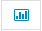
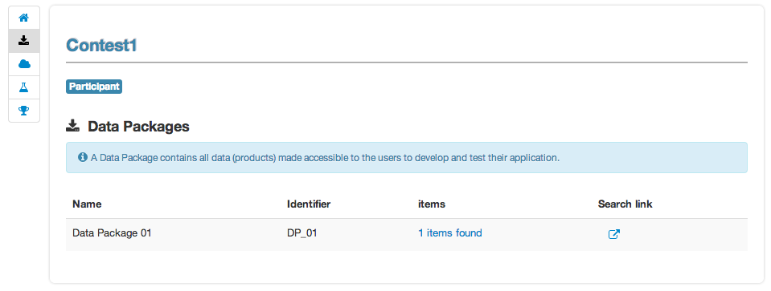
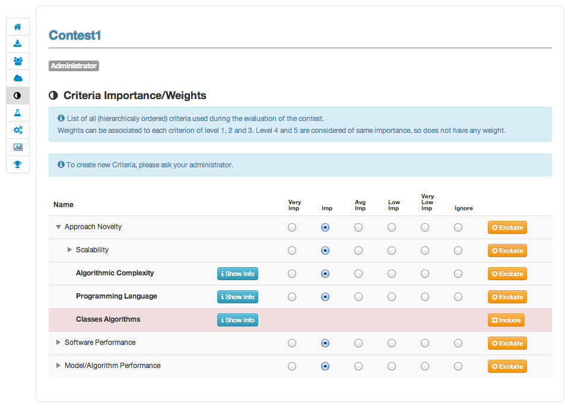
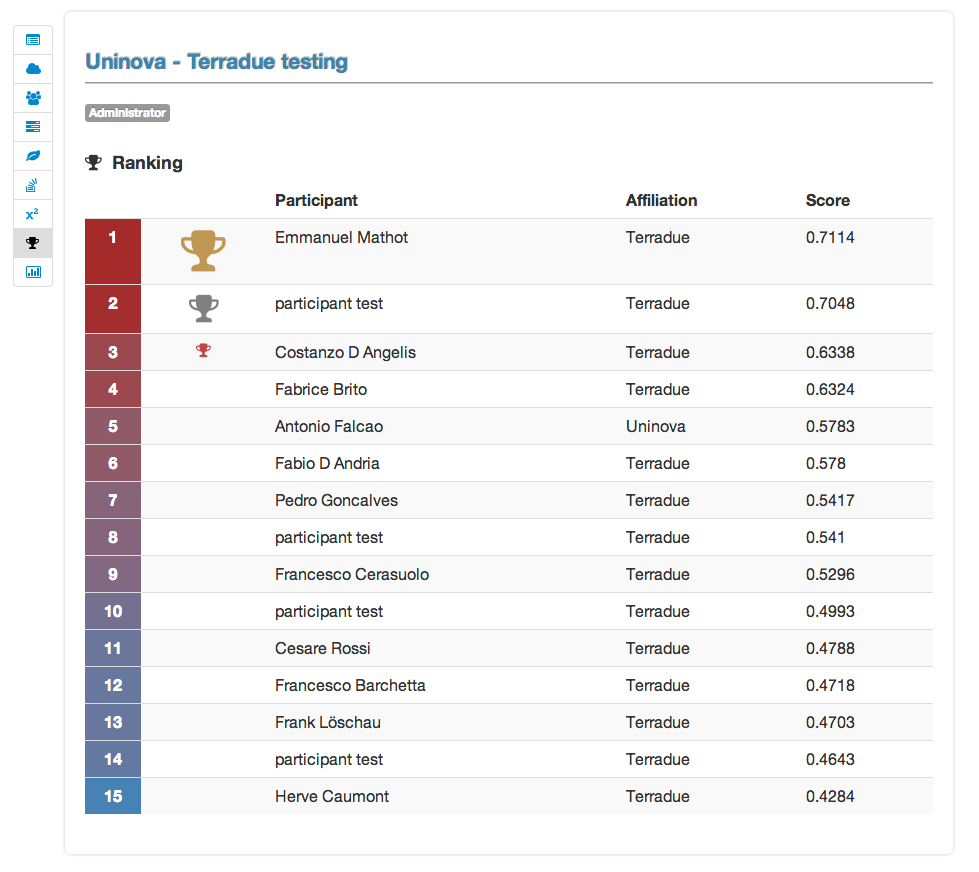

Administrator Guide
===================

Role description
----------------

An **administrator** in E-CEO platform will be in charge of administrating one or several challenges.
Challenge **administrators** will use the platform to:

-  set-up environments,
-  define series and data packages,
-  add new **initiator** user,
-  accept or reject users for a challenge,
-  validate participant applications

Note that **administrator** can also do all actions that **initiator** or **evaluator** can do. Please also refer to <initator> or <evaluator>.

Challenge view
--------------

The challenge view contains all the different pages associated to a challenge. The accessible pages are not the same depending on the role of the challenge.
The pages are accessible from a vertical menu bar on the left.

|contestviewmenu.png|

The list of pages accessible are (with type of user who can access it):

-  |contestviewmenuhome.png| Challenge description
-  |contestviewmenudatapackage.png| Data packages
-  |contestviewmenuusers.png| Challenge users
-  |contestviewmenuenvironments.png| Environments
-  |contestviewmenucriteria.png| Criteria importance/weights
-  |contestviewmenuapplications.png| Participants applications
-  |contestviewmenumetrics.png| Evaluation metrics
-  |contestviewmenuevaluationresults.png| Evaluation results
-  |contestviewmenuranking.png| Ranking

Challenge view (global description)
^^^^^^^^^^^^^^^^^^^^^^^^^^^^^^^^^^^^^^^^
Please refer to <initator>.

Challenge view - Data packages
^^^^^^^^^^^^^^^^^^^^^^^^^^^^^^
Please refer to <initator>.

Data package items management
^^^^^^^^^^^^^^^^^^^^^^^^^^^^^^^
Please refer to <initator>.

Challenge view - users
^^^^^^^^^^^^^^^^^^^^^^
Please refer to <initator>.

Challenge view - environments
^^^^^^^^^^^^^^^^^^^^^^^^^^^^^^
Please refer to <initator>.

Challenge view - criteria importance/weights
^^^^^^^^^^^^^^^^^^^^^^^^^^^^^^^^^^^^^^^^^^^^
Please refer to <evaluator>.

Challenge view - applications (Administrator)
^^^^^^^^^^^^^^^^^^^^^^^^^^^^^^^^^^^^^^^^^^^^^^^^^^^

Inside the challenge view, the application part contains the information about the applications the administrator needs to validate.

|contestviewapplicationsadmin.png|

The Administrator can then decide to **Validate the application** or **Discard the application** if he juges its not suitable for being evaluated, by clicking on the corresponding button.

Challenge view - metrics
^^^^^^^^^^^^^^^^^^^^^^^^
Please refer to <evaluator>.

Challenge view - evaluation results
^^^^^^^^^^^^^^^^^^^^^^^^^^^^^^^^^^^^^^^^^
Please refer to <evaluator>.

Challenge view - ranking
^^^^^^^^^^^^^^^^^^^^^^^^^^^^^^
Please refer to <evaluator>.

Settings - Manage Users
^^^^^^^^^^^^^^^^^^^^^^^^

From the **Settings** |settings.png| from the menu bar, select **Manage User**.

To manage users for a challenge, if not selected, select the tab **Users by Challenges**.

|usermanagement.png|

Click on **change** to change either the Initiator or the Evaluator of the challenge, and then select the user you want to choose.

Click on **manage** to accept or reject participants for a challenge. From there, you can Accept |accept.png| or Deny |denied.png| a user.

|participantmanagement.png|

To manage users in general, if not selected, select the tab **All Users**.

From there it is possible to set a user as global Initiator (this user will have rights to create a new challenge).

|usermanagement3.png|

Settings - Manage Data Series
^^^^^^^^^^^^^^^^^^^^^^^^^^^^^^

From the **Settings** |settings.png| from the menu bar, select **Manage Series**. The list of existing series will appear. To create a new one click on **Add Data Series**.
Once all the fields filled, save by clicking **Insert**.

|seriescreation.png|

Settings - Manage Environments
^^^^^^^^^^^^^^^^^^^^^^^^^^^^^^

From the **Settings** |settings.png| from the menu bar, select **Manage** **Environments**.

|manageenvironment.png|

The Template Settings part allow to select the provider, virtual network and template for the challenge. These settings will be used when the environments are generated.
To create a new environment, click on **Create**.

It is also possible to stop |stopenv.png|, resume |startenv.png| or delete |deleteenv.png| an existing environment.

Settings - Manage Criteria
^^^^^^^^^^^^^^^^^^^^^^^^^^

From the control panel, select **Manage** **Criteria**.

The Administrator can manage the criteria (independently of challenges) from this page by creating new ones |newcriterion.png| or deleting definitively existing ones |newcriterionDescription.png|.
The “Unit/Dimension” field is a list representing the unit of the value of the criterion.

The “Quantification” and “Normalization” fields are both meant to contain formulas. To write a formula, add “$$” in the beginning and in the end of the latex formula. The formula will be displayed on the right part.

The “Quantificationlogic” is the logic used for normalization of the value obtained after quantification. It can be chosen between “Higher is Better” and “Lower is Better”.

The “Actor” field indicates who is calculating the value of the criterion. It could be the system or the evaluator.
Save the new criterion by clickin on **Save Criterion**.
Clicking on **Show info / Modify Criteria** will open the Criteria view.

|criterionpage.png|

.. |contestcreated.png| image:: includes/sum/contest_created.png
.. |contestpromoted.png| image:: includes/sum/contest_promoted.png
.. |contestopen.png| image:: includes/sum/contest_open.png
.. |contestinprogress.png| image:: includes/sum/contest_in_progress.png
.. |contestonevaluation.png| image:: includes/sum/contest_on_evaluation.png
.. |contestclosed.png| image:: includes/sum/contest_closed.png
.. |settings.png| image:: includes/sum/settings.png
.. |homepage.png| image:: includes/sum/homepage.png
.. |userinfo.png| image:: includes/sum/user_info.png
.. |userprofile.png| image:: includes/sum/user_profile.png
.. |certifupload.png| image:: includes/sum/certif_upload.png
.. |createcontest.png| image:: includes/sum/create_contest.png
.. |modify-icon.png| image:: includes/sum/modify-icon.png
.. |delete.png| image:: includes/sum/delete.png
.. |users.png| image:: includes/sum/users.png
.. |metrics.png| image:: includes/sum/metrics.png
.. |contestmodify.png| image:: includes/sum/contest_modify.png
.. |contestjoin.png| image:: includes/sum/contest_join.png
.. |contestviewmenu.png| image:: includes/sum/contestview_menu.png
.. |contestviewmenuhome.png| image:: includes/sum/contestview_menu_home.png
.. |contestviewmenudatapackage.png| image:: includes/sum/contestview_menu_datapackage.png
.. |contestviewmenuusers.png| image:: includes/sum/contestview_menu_users.png
.. |contestviewmenuenvironments.png| image:: includes/sum/contestview_menu_environments.png
.. |contestviewmenucriteria.png| image:: includes/sum/contestview_menu_criteria.png
.. |contestviewmenuapplications.png| image:: includes/sum/contestview_menu_applications.png
.. |contestviewmenumetrics.png| image:: includes/sum/contestview_menu_metrics.png

.. |contestviewmenuranking.png| image:: includes/sum/contestview_menu_ranking.png
.. |contestviewdescription.png| image:: includes/sum/contestview_description.png

.. |deleteenv.png| image:: includes/sum/delete_env.png
.. |contestviewdatapackageinitiator.png| image:: includes/sum/contestview_datapackage_initiator.png
.. |contestviewusers.png| image:: includes/sum/contestview_users.png
.. |contestviewenvironments.png| image:: includes/sum/contestview_environments.png

.. |dashboardpage.png| image:: includes/sum/dashboard_page.png
.. |oozieMonitor.png| image:: includes/sum/oozieMonitor.png
.. |contestviewapplicationsparticipant.png| image:: includes/sum/contestview_applications_participant.png
.. |appref.png| image:: includes/sum/appref.png
.. |updateappref.png| image:: includes/sum/update_appref.png
.. |contestviewapplicationsparticipant2.png| image:: includes/sum/contestview_applications_participant2.png
.. |contestviewapplicationsadmin.png| image:: includes/sum/contestview_applications_admin.png
.. |appevalref.png| image:: includes/sum/appevalref.png
.. |updateevalref.png| image:: includes/sum/update_evalref.png
.. |contestviewapplicationsevaluator.png| image:: includes/sum/contestview_applications_evaluator.png

.. |contestviewevaluationtreeparticipant.png| image:: includes/sum/contestview_evaluationtree_participant.png
.. |contestviewmetrics.png| image:: includes/sum/contestview_metrics.png
.. |contestviewscores.png| image:: includes/sum/contestview_scores.png
.. |contestviewlinguisticterms.png| image:: includes/sum/contestview_linguisticterms.png
.. |contestviewevaluationresults.png| image:: includes/sum/contestview_evaluationresults.png

.. |search.png| image:: includes/sum/search.png
.. |bbox2.png| image:: includes/sum/bbox2.png
.. |bbox1.png| image:: includes/sum/bbox1.png
.. |datapackageitemmanagement.png| image:: includes/sum/datapackage_item_management.png
.. |csvdownload.png| image:: includes/sum/csv_download.png
.. |evaluation.png| image:: includes/sum/evaluation.png
.. |controlpanel.png| image:: includes/sum/controlpanel.png
.. |usermanagement.png| image:: includes/sum/user_management.png
.. |accept.png| image:: includes/sum/accept.png

.. |participantmanagement.png| image:: includes/sum/participant_management.png
.. |usermanagement3.png| image:: includes/sum/user_management3.png
.. |seriescreation.png| image:: includes/sum/series_creation.png
.. |manageenvironment.png| image:: includes/sum/manage_environment.png
.. |stopenv.png| image:: includes/sum/stop_env.png
.. |startenv.png| image:: includes/sum/start_env.png
.. |newcriterion.png| image:: includes/sum/new_criterion.png
.. |deletecriterion.png| image:: includes/sum/delete_criterion.png
.. |newcriterionDescription.png| image:: includes/sum/new_criterion_Description.png
.. |criterionpage.png| image:: includes/sum/criterion_page.png
.. |htmlsupport.png| image:: includes/sum/html_support.png
.. |htmlsupport2.png| image:: includes/sum/html_support2.png
.. |bell.png| image:: includes/sum/bell.png
.. |notifications.png| image:: includes/sum/notifications.png
.. |rssfeed.png| image:: includes/sum/rssfeed.png
.. |notificationsfeed.png| image:: includes/sum/notifications_feed.png
.. |metricsxml.png| image:: includes/sum/metricsxml.png
.. |scoresxml.png| image:: includes/sum/scoresxml.png
.. |scorescsv.png| image:: includes/sum/scorescsv.png
.. |scorecsvtext.png| image:: includes/sum/scorecsvtext.png
