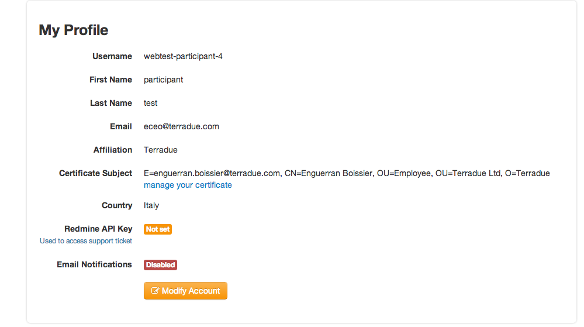
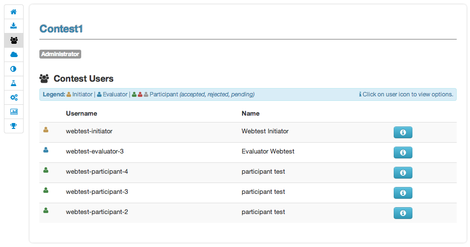
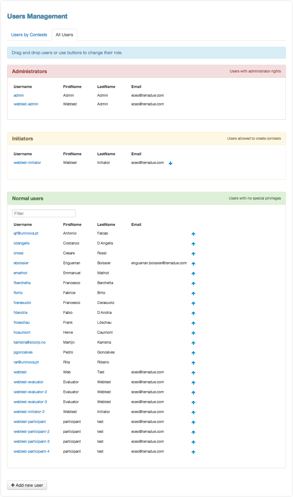
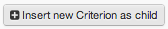
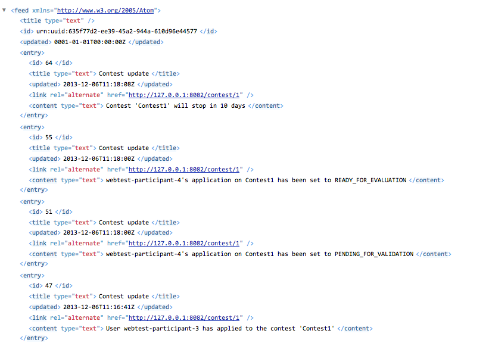

Initiator Guide
================

Role description
----------------

An **evaluator** in E-CEO platform is the person in charge of the evaluation of a challenge. He is the one running and evaluating all applications of participants.
Challenge **evaluators** will use the platform to:

-  define challenge evaluation tree,
-  evaluate participant application,
-  get information about the Evaluation Environment

Challenge view
----------------

The challenge view contains all the different pages associated to a challenge. The accessible pages are not the same depending on the role of the challenge.
The pages are accessible from a vertical menu bar on the left.

|image: contestview\_menu.png|

The list of pages accessible are (with type of user who can access it):

-  |image: contestview\_menu\_home.png| Challenge description
-  |image: contestview\_menu\_datapackage.png| Data packages
-  |image: contestview\_menu\_environments.png| Environments
-  |image: contestview\_menu\_criteria.png| Criteria importance/weights
-  |image: contestview\_menu\_applications.png| Participants applications
-  |image: contestview\_menu\_metrics.png| Evaluation metrics
-  |image: contestview\_menu\_evaluationresults.png| Evaluation results
-  |image: contestview\_menu\_ranking.png| Ranking

Challenge view (global description)
^^^^^^^^^^^^^^^^^^^^^^^^^^^^^^^^^^^^^^^^

From the home page, the user can choose **My Challenges** in the menu bar and then click on the challenge name to select it.
The first page he will see is the challenge description page.

|image: contestview\_description.png|

Challenge view - Data packages
^^^^^^^^^^^^^^^^^^^^^^^^^^^^^^

The list of Data packages accessible for the participant is displayed, including the items associated to this data package and the search link used inside the application.xml file of the user application.

|image: contestview\_datapackage\_participant.png|

Challenge view - environments
^^^^^^^^^^^^^^^^^^^^^^^^^^^^^^^^^^^

From this page, the user can access information about its environments
(Initiator and Administrator can see all environments of the challenge,
but Evaluator and Participants can see only their environment).

|image: contestview\_environments.png|

For each environment, it is possible to access the dashboard |image: dashboard.png| as well as the oozie monitor |image: oozie.png|.
The dashboard contains all information about the environment.

|image: dashboard\_page.png|

The oozie monitor page list all runs associated to an environment, including information about each part of the workflow.

|image: oozieMonitor.png|

For each node of the workflow, the color indicates if the task failed, succeded or is running.
To access the information about the run, you can click on **Run information** to expend the div.

Challenge view - applications
^^^^^^^^^^^^^^^^^^^^^^^^^^^^^

Inside the challenge view the application part contains the information about the applications the evaluator needs to evaluate.

First the Evaluator has to choose an Application Reference by clicking on |image: appevalref.png| (this correspond to the run the evaluator launched to evaluate the
application of the participant).

|image: update\_evalref.png|

The evaluator can **Quantify** the application (this will automatically apply the quantification process on the application) or set the application as **Manually Evaluated** (this means he manually edited the quantification scores from the portal or from the Evaluation environment) by clicking on the corresponding button.

|image: contestview\_applications\_evaluator.png|

The Evaluator can also apply quantification on all applications (**Quantify all**) or set them all as manually quantified (**Quantify all (manually)**).

Once all applications are quantified, the evaluator can do the final step of the evaluation which is the normalization by clicking on
**Evaluate all**. This will normalize all applications together and create scores between 0 and 1 for each criterion. It will also apply selected weights on each criterion.

Challenge view - criteria importance/weights
^^^^^^^^^^^^^^^^^^^^^^^^^^^^^^^^^^^^^^^^^^^^

From the challenge view, evaluation tree can be updated in the following way:

-  change weight of a specific criterion (selection with radio button),
-  add new criterion to the challenge, clicking **Include** (the criterion has to be created by the administrator,
-  remove existing criterion from the challenge, clicking **Exclude** (the criterion is only removed from the challenge, not at the global level).

|image: contestview\_evaluationtree\_evaluator.png|

Challenge view - metrics
^^^^^^^^^^^^^^^^^^^^^^^^

From this page, the Evaluator can trigger evaluation results, such as metrics and quantification scores.

Metrics are results from the run of the participant's application.
Evaluator can add new metrics which will be used for the evaluation process.

|image: contestview\_metrics.png|

Quantification scores are results from the quantification of the participant's application, taking metrics as an input. Scripts are also available on the Evaluation platform to do all these actions in a easiest way.

|image: contestview\_scores.png|

Linguistic Terms are key/value association made from the Evaluator to evaluate some criterion whose value is a string.

|image: contestview\_linguisticterms.png|

Challenge view - evaluation results
^^^^^^^^^^^^^^^^^^^^^^^^^^^^^^^^^^^^^^^^^

From this page, the user can access the results of the evaluation of the
challenge. He can have in a quick look the view of all partcipant's scores
amongst each other, and access more detailed results.

Moving the mouse over one participant's name will make it appear in bold
compare to the others in the graph. Clicking on |image: contestview\_menu\_evaluationresults.png|
on the table will redirect to the specified evaluation of the corresponding participant.

|image: contestview\_evaluationresults.png|

Challenge view - ranking
^^^^^^^^^^^^^^^^^^^^^^^^^^^^^^

From this page, the user can access the ranking of the challenge (note
this page is also visible without being logged, but some information may
be not visible in that case).

|image: contestview\_ranking.png|

Participant evaluation view
^^^^^^^^^^^^^^^^^^^^^^^^^^^^^^^^^^^

Each participant can access its own evaluation results. It correspond to a page showing a graph with for each criterion the min and max score as well as Participant score.

It is also possible to switch between normalized scores and raw scores (not normalized) of the participant.

The user can also dowload a csv file containing all the results by clicking on |image: evaluation.png|

Evaluation tools
----------------

On the Evaluation environment, a list of tools is available to ease Evaluator's evaluation process.

eceo-addmetrics
^^^^^^^^^^^^^^^

Add a name/value element(s) into monitor/monitor.xml file of the specified run.

usage:
-  eceo-addmetrics -r <runId> -n <metricsName> -v <metricsValue>
-  eceo-addmetrics -r <runId> -f <metricsFile>

|image: metricsxml.png|

eceo-addscore
^^^^^^^^^^^^^

Add a name/value element into monitor/scores.xml file of the specified run. Score is the result of quantification process.

usage:
-  eceo-addscore-r <runId> -n <scoreName> -v <scoreValue>
-  eceo-addscore-r <runId> -f <scoreFile>

|image: scoresxml.png|

eceo-csvtoscore
^^^^^^^^^^^^^^^

Update the file monitor/scores.xml of the specified run using entries inside the csv. Score is the result of quantification process.

usage:
-  eceo-csvtoscore -f <csvFile>

|image: scorescsv.png|

|image: scorecsvtext.png|

eceo-csvtoxmlscore
^^^^^^^^^^^^^^^^^^

Create a list of scores-runID.xml files. Score is the result of quantification process.

Evaluator can then review them and upload them into the run folder using eceo-addscore command.

usage:
-  eceo-csvtoxmlscore -f <csvFile>

.. |image: challenge\_created.png| image:: includes/sum/challenge_created.png
.. |image: challenge\_promoted.png| image:: includes/sum/challenge_promoted.png
.. |image: challenge\_open.png| image:: includes/sum/challenge_open.png
.. |image: challenge\_in\_progress.png| image:: includes/sum/challenge_in_progress.png
.. |image: challenge\_on\_evaluation.png| image:: includes/sum/challenge_on_evaluation.png
.. |image: challenge\_closed.png| image:: includes/sum/challenge_closed.png
.. |image: settings.png| image:: includes/sum/settings.png
.. |image: homepage.png| image:: includes/sum/homepage.png
.. |image: user\_info.png| image:: includes/sum/user_info.png

.. |image: certif\_upload.png| image:: includes/sum/certif_upload.png
.. |image: create\_challenge.png| image:: includes/sum/create_challenge.png
.. |image: modify-icon.png| image:: includes/sum/modify-icon.png
.. |image: delete.png| image:: includes/sum/delete.png
.. |image: users.png| image:: includes/sum/users.png
.. |image: metrics.png| image:: includes/sum/metrics.png
.. |image: challenge\_modify.png| image:: includes/sum/challenge_modify.png
.. |image: challenge\_join.png| image:: includes/sum/challenge_join.png
.. |image: contestview\_menu.png| image:: includes/sum/contestview_menu.png
.. |image: contestview\_menu\_home.png| image:: includes/sum/contestview_menu_home.png
.. |image: contestview\_menu\_datapackage.png| image:: includes/sum/contestview_menu_datapackage.png
.. |image: contestview\_menu\_users.png| image:: includes/sum/contestview_menu_users.png
.. |image: contestview\_menu\_environments.png| image:: includes/sum/contestview_menu_environments.png

.. |image: contestview\_menu\_applications.png| image:: includes/sum/contestview_menu_applications.png
.. |image: contestview\_menu\_metrics.png| image:: includes/sum/contestview_menu_metrics.png
.. |image: contestview\_menu\_evaluationresults.png| image:: includes/sum/contestview_menu_evaluationresults.png
.. |image: contestview\_menu\_ranking.png| image:: includes/sum/contestview_menu_ranking.png
.. |image: contestview\_description.png| image:: includes/sum/contestview_description.png
.. |image: contestview\_datapackage\_participant.png| image:: includes/sum/contestview_datapackage_participant.png
.. |image: delete\_env.png| image:: includes/sum/delete_env.png
.. |image: contestview\_datapackage\_initiator.png| image:: includes/sum/contestview_datapackage_initiator.png

.. |image: contestview\_environments.png| image:: includes/sum/contestview_environments.png
.. |image: dashboard.png| image:: includes/sum/dashboard.png
.. |image: oozie.png| image:: includes/sum/oozie.png
.. |image: dashboard\_page.png| image:: includes/sum/dashboard_page.png
.. |image: oozieMonitor.png| image:: includes/sum/oozieMonitor.png
.. |image: contestview\_applications\_participant.png| image:: includes/sum/contestview_applications_participant.png
.. |image: appref.png| image:: includes/sum/appref.png
.. |image: update\_appref.png| image:: includes/sum/update_appref.png
.. |image: contestview\_applications\_participant2.png| image:: includes/sum/contestview_applications_participant2.png
.. |image: contestview\_applications\_admin.png| image:: includes/sum/contestview_applications_admin.png
.. |image: appevalref.png| image:: includes/sum/appevalref.png
.. |image: update\_evalref.png| image:: includes/sum/update_evalref.png
.. |image: contestview\_applications\_evaluator.png| image:: includes/sum/contestview_applications_evaluator.png
.. |image: contestview\_evaluationtree\_evaluator.png| image:: includes/sum/contestview_evaluationtree_evaluator.png
.. |image: contestview\_evaluationtree\_participant.png| image:: includes/sum/contestview_evaluationtree_participant.png
.. |image: contestview\_metrics.png| image:: includes/sum/contestview_metrics.png
.. |image: contestview\_scores.png| image:: includes/sum/contestview_scores.png
.. |image: contestview\_linguisticterms.png| image:: includes/sum/contestview_linguisticterms.png
.. |image: contestview\_evaluationresults.png| image:: includes/sum/contestview_evaluationresults.png
.. |image: contestview\_ranking.png| image:: includes/sum/contestview_ranking.png
.. |image: search.png| image:: includes/sum/search.png
.. |image: bbox2.png| image:: includes/sum/bbox2.png
.. |image: bbox1.png| image:: includes/sum/bbox1.png
.. |image: datapackage\_item\_management.png| image:: includes/sum/datapackage_item_management.png

.. |image: evaluation.png| image:: includes/sum/evaluation.png
.. |image: controlpanel.png| image:: includes/sum/controlpanel.png
.. |image: user\_management.png| image:: includes/sum/user_management.png
.. |image: accept.png| image:: includes/sum/accept.png
.. |image: denied.png| image:: includes/sum/denied.png
.. |image: participant\_management.png| image:: includes/sum/participant_management.png

.. |image: series\_creation.png| image:: includes/sum/series_creation.png
.. |image: manage\_environment.png| image:: includes/sum/manage_environment.png
.. |image: stop\_env.png| image:: includes/sum/stop_env.png
.. |image: start\_env.png| image:: includes/sum/start_env.png

.. |image: delete\_criterion.png| image:: includes/sum/delete_criterion.png
.. |image: new\_criterion\_Description.png| image:: includes/sum/new_criterion_Description.png
.. |image: criterion\_page.png| image:: includes/sum/criterion_page.png
.. |image: html\_support.png| image:: includes/sum/html_support.png
.. |image: html\_support2.png| image:: includes/sum/html_support2.png
.. |image: bell.png| image:: includes/sum/bell.png
.. |image: notifications.png| image:: includes/sum/notifications.png

.. |image: metricsxml.png| image:: includes/sum/metricsxml.png
.. |image: scoresxml.png| image:: includes/sum/scoresxml.png
.. |image: scorescsv.png| image:: includes/sum/scorescsv.png
.. |image: scorecsvtext.png| image:: includes/sum/scorecsvtext.png
