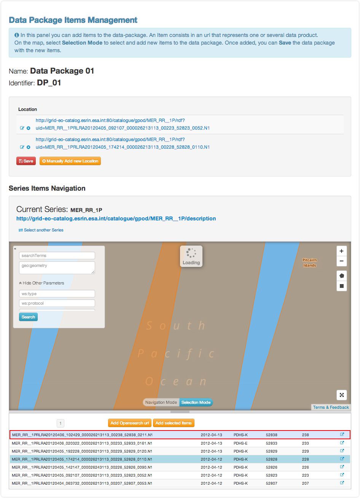

Initiator Guide
================

Role description
----------------

In the e-Collaboration for Earth Observation data challenges platform, the **initiator**  is the person in charge of the creation and management of the challenge during its lifecycle.

Challenge **initiators** use the platform to:

*  Define a challenge
*  Define data series and data packages associated to the challenge
*  Update the challenge phases
*  Accept or reject participants for the challenge

Challenge creation 
------------------

From the top menu bar, the **Initiator** can click on the “Settings” |settings.png| button and then click on **Create a Challenge** .

Otherwise, from the **My Challenges**  list in the menu bar, the **Initiator** can click on **Create a new Challenge**  (in the bottom of the list of challenges).

.. image:: includes/sum/create_contest.png
	:align: center

From the challenge creation page, fill the form with all information needed for the challenge and click **Create**  to save it. See `Challenge modification`_ for list of forms to be filled. 

Each form comes with a small description defining what to put inside.

The new created  challenge will be added in the list of “my challenges”.

.. _`Challenge modification`:

Challenge modification 
----------------------

From the home page, the Initiator can choose **My Challenges**  in the menu bar and then click on the “modify” icon |modify-icon.png| of the challenge.

Note that the challenge modification page can also be accessed from the challenge view page (description view, in the bottom of the page).

.. image:: includes/sum/contest_modify.png
	:align: center

Once all edit have been done, the Initiator may save the challenge by clicking on **Save Challenge** .

All fields containing information about the challenge can be edited.

Challenge view
--------------

The challenge view contains all the different pages associated to a challenge. 

The accessible pages are not the same depending on the role of the challenge.

The pages are accessible from a vertical menu bar on the left.

The list of pages accessible for an **initiator** are:

-  |contestviewmenuhome.png| Challenge description
-  |contestviewmenudatapackage.png| Data packages
-  |contestviewmenuusers.png| Challenge users
-  |contestviewmenuenvironments.png| Environments
-  |contestviewmenuevaluationresults.png| Evaluation results
-  |contestviewmenuranking.png| Ranking

Global description
^^^^^^^^^^^^^^^^^^

From the home page, the user can choose **My Challenges**  in the menu bar and then click on the challenge name to select it.

The first page shows the challenge description page.

.. image:: includes/sum/contestview_description.png
	:align: center

From this page, the Initiator has the possiblity to **Modify** or **Delete** the challenge. 

He can also do the following actions, clicking on the corresponding button (right of the status):

-  **Make the challenge visible** (challenge is visible but not open for participants to join)
-  **Open challenge** (challenge is visible and participants can join)
-  **Start challenge** (challenge starts)
-  **Stop challenge** (challenge stop for participants, evaluation begins)
-  **Publish challenge** (evaluation is done, the challenge is closed and results are available).

Data packages
^^^^^^^^^^^^^

The list of existing Data Package is displayed, including the items associated to this data package and the search link used inside the
application.xml file of the user application.

It is possible to insert a new data package (fill “name”, “identifier”
and choose if it should be accessible for Participants, then click on
**Insert** ), edit |modify-icon.png| (change name or identifier), or delete |deleteenv.png| an existing one.

It is also possible to manage data packages items (click on **Manage Items** ).

.. image:: includes/sum/contestview_datapackage_initiator.png
	:align: center

Data package items management
^^^^^^^^^^^^^^^^^^^^^^^^^^^^^

From this page, the Initiator can select the items he wants to have in the data package. 

The initiator first selects the data series to use to find items by clicking on **Select another Series**.

There are several ways to add items to the data package:

*  Add any link manually, by clicking **Manually Add new Location**
*  Add an Opensearch url, by cliking **Add Opensearch url** once the search request build
*  Add one or several items from the results on the map, choosing **Selection Mode** on the map (click on one or several item to select them)

Once data package items have been added, click on **Save**.

To build the Opensearch request, click on |search.png| and fill the parameters that correspond to the search. 

It is possible to click on |bbox2.png| or |bbox1.png| to respectively draw a rectangle or a polygon on a map that will correspond to the search area (geo:box).

Users
^^^^^

From this page, the initiator can access the list of users participating to the challenge. 

By clicking on the corresponding user icon, the initiator can also:

*  Select or change the evaluator
*  Allow or deny participants to the challenge

.. image:: includes/sum/contestview_users.png
	:align: center

Environments
^^^^^^^^^^^^

From this page, the user can access information about his environments.

Note: Initiators and Administrators can see all environments of the challenge, but the Evaluator and Participants can only see their environment.*

.. image:: includes/sum/contestview_environments.png
	:align: center

For each environment, it is possible to access the dashboard |dashboard.png| as well as the oozie monitor |oozie.png| .
The dashboard contains all information about the environment.

.. image:: includes/sum/dashboard_page.png
	:align: center
	
The oozie monitor page list all runs associated to an environment,
including information about each part of the workflow.

.. image:: includes/sum/oozieMonitor.png
	:align: center
	
For each node of the workflow, the color indicates if the task failed, succeded or is running.

To access the information about the run, you can click on **Run information**  to expend the div.

Evaluation results
^^^^^^^^^^^^^^^^^^

From this page, the user can access the results of the evaluation of the challenge. 

He can have in a quick look the view of all participant's scores amongst each other, and access more detailed results.

Moving the mouse over one participant's name will make it appear in bold to compare to the others in the graph. 

Clicking on |contestviewmenuevaluationresults.png| on the table will redirect to the specified evaluation of the corresponding participant.

.. image:: includes/sum/contestview_evaluationresults.png
	:align: center
	
Participant evaluation view
^^^^^^^^^^^^^^^^^^^^^^^^^^^

Each participant can access its own evaluation results. It correspond to a page showing a graph with for each criterion the min and max score as well as Participant score.

.. image:: includes/sum/evaluation.png
	:align: center

It is also possible to switch between normalized scores and raw scores (not normalized) of the participant.

The user can also dowload a csv file containing all the results by clicking on |csvdownload.png|.

Ranking
^^^^^^^

From this page, the user can access the ranking of the challenge.

Note this page is also visible without being logged, but, it that case, some information may be not visible.

.. image:: includes/sum/contestview_ranking.png
	:align: center
	
Settings
--------

Manage Data Series
^^^^^^^^^^^^^^^^^^

From the Settings button on the top menu bar, select **Manage Series**. 

The list of existing series will appear. 

To create a new one click on **Add Data Series**.

Once all the fields filled, save by clicking **Insert**.

.. image:: includes/sum/series_creation.png
	:align: center
	
.. |settings.png| image:: includes/sum/settings.png
.. |contestviewmenuhome.png| image:: includes/sum/contestview_menu_home.png
.. |contestviewmenudatapackage.png| image:: includes/sum/contestview_menu_datapackage.png
.. |contestviewmenuusers.png| image:: includes/sum/contestview_menu_users.png
.. |contestviewmenuenvironments.png| image:: includes/sum/contestview_menu_environments.png
.. |contestviewmenuevaluationresults.png| image:: includes/sum/contestview_menu_evaluationresults.png
.. |contestviewmenuranking.png| image:: includes/sum/contestview_menu_ranking.png
.. |modify-icon.png| image:: includes/sum/modify-icon.png
.. |dashboard.png| image:: includes/sum/dashboard.png
.. |oozie.png| image:: includes/sum/oozie.png
.. |deleteenv.png| image:: includes/sum/delete_env.png
.. |search.png| image:: includes/sum/search.png
.. |bbox2.png| image:: includes/sum/bbox2.png
.. |bbox1.png| image:: includes/sum/bbox1.png
.. |csvdownload.png| image:: includes/sum/csv_download.png
