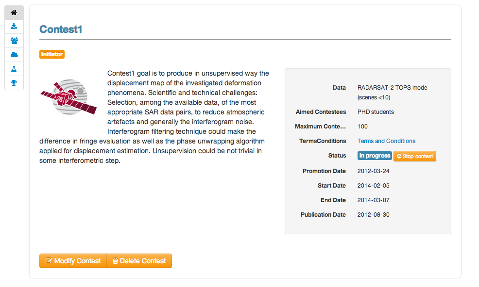
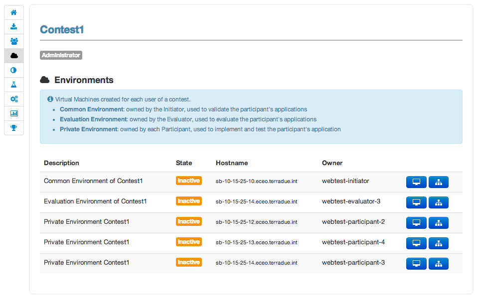
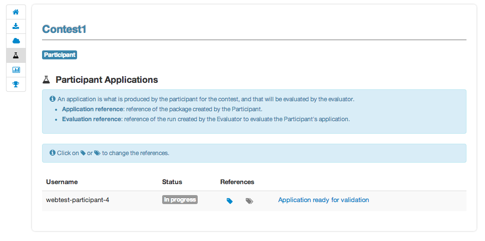
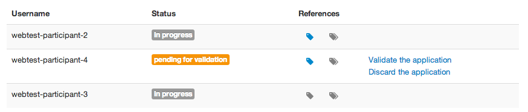
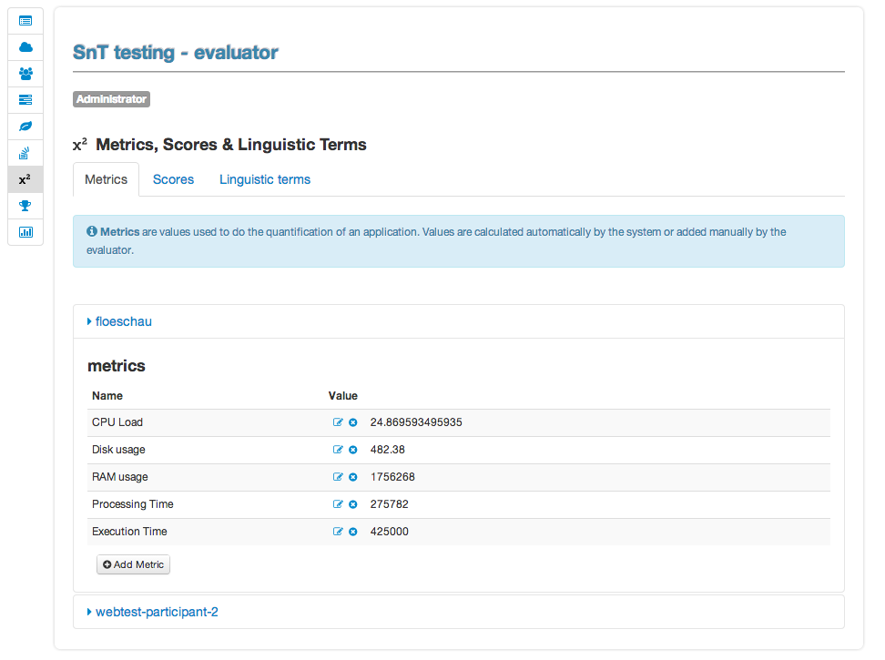
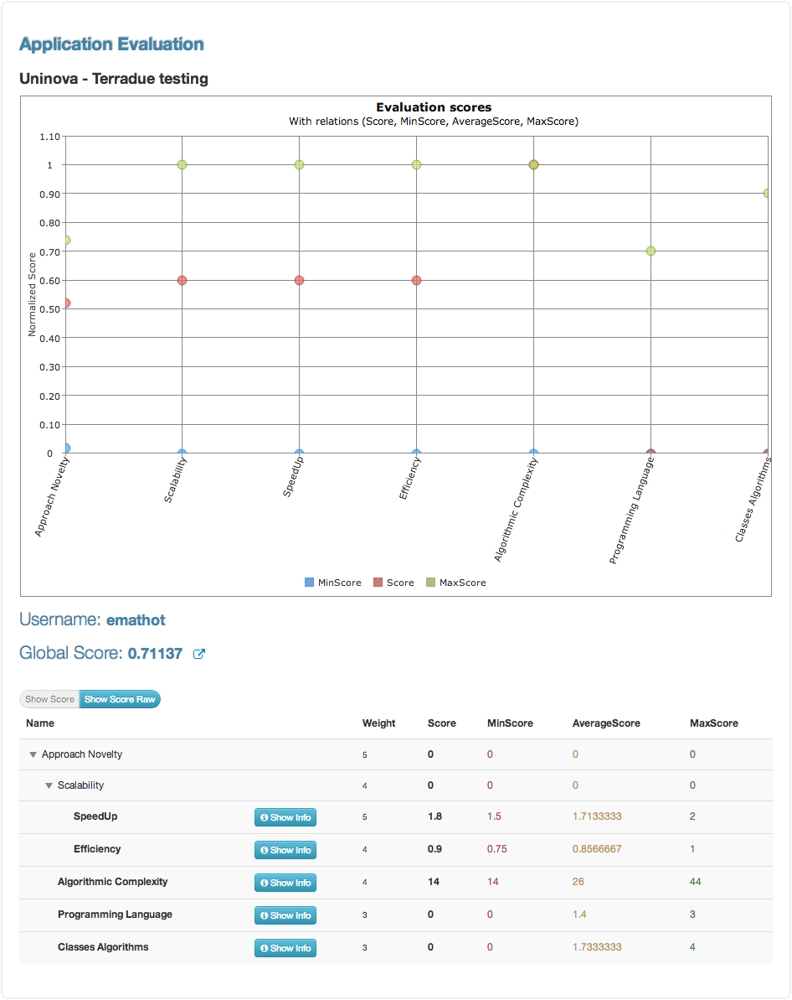

Initiator Guide
================

Role description
----------------

An **initiator** in E-CEO platform is the person in charge of a challenge. He is the one creating it and managing it during the life of the challenge.
Challenge **initiators** will use the platform to:

-  define a challenge,
-  get challenge status and evolution,
-  accept or reject users for a challenge,
-  define data packages

Challenge creation 
----------------

From the top menu bar, the **Initiator** can click on the “Settings” |image: settings.png| button and then click on **Create a Challenge** .
Otherwise, from the **My Challenges**  list in the menu bar, the **Initiator** can click on **Create a new Challenge**  (in the bottom of the list of challenges).

|image: create\_challenge.png|

From the challenge creation page, fill the form with all information
needed for the challenge and click **Create**  to save it. The new
challenge will be added in the list of “my challenges”.

Challenge modification 
----------------

From the home page, the Initiator can choose **My Challenges**  in
the menu bar and then click on the “modify” icon |image: modify-icon.png| of the challenge.
Note that the challenge modification page can also be accessed from the challenge view page (description view, in the bottom of the page).

|image: challenge\_modify.png|

Once all edit have been done, the Initiator may save the challenge by clicking on **Save Challenge** .
All fields containing information about the challenge can be edited.

Challenge view
----------------

The challenge view contains all the different pages associated to a
challenge. The accessible pages are not the same depending on the role of
the challenge.

The pages are accessible from a vertical menu bar on the left.

|image: contestview\_menu.png|

The list of pages accessible are (with type of user who can access it):

-  |image: contestview\_menu\_home.png| Challenge description
-  |image: contestview\_menu\_datapackage.png| Data packages
-  |image: contestview\_menu\_users.png| Challenge users
-  |image: contestview\_menu\_environments.png| Environments
-  |image: contestview\_menu\_evaluationresults.png| Evaluation results
-  |image: contestview\_menu\_ranking.png| Ranking

Challenge view (global description)
^^^^^^^^^^^^^^^^^^^^^^^^^^^^^^^^^^^^^^^^

From the home page, the user can choose **My Challenges**  in the
menu bar and then click on the challenge name to select it.

The first page he will see is the challenge description page.

|image: contestview\_description.png|

The Initiator has the possiblity from this page to **Modify** or
**Delete** the challenge. He can also do the following actions, clicking
on the corresponding button (right of the status):

-  **Make the challenge visible**\ (challenge is visible but not open for participants to join)
-  **Open challenge** (challenge is visible and participants can join)
-  **Start challenge**\ (challenge starts)
-  **Stop challenge** (challenge stop for participants, evaluation begins)
-  **Publish challenge** (evaluation is done, the challenge is closed and results are available).

Challenge view - Data packages
^^^^^^^^^^^^^^^^^^^^^^^^^^^^^^

The list of existing Data Package is displayed, including the items
associated to this data package and the search link used inside the
application.xml file of the user application.

It is possible to insert a new data package (fill “name”, “identifier”
and choose if it should be accessible for Participants, then click on
**Insert** ), edit |image: modify-icon.png| (change name or identifier), or delete |image: delete\_env.png| an existing one.

It is also possible to manage data packages items (click on **Manage Items** ).

|image: contestview\_datapackage\_initiator.png|

Data package items management
^^^^^^^^^^^^^^^^^^^^^^^^^^^^^^^

From this page, the Initiator can select the items he wants to have in
the data package. He would need first to select the data series he wants
to use to find items bu clicking on **Select another Series**.

There are several ways to add items on the data package:

-  Add any link manually, by clicking **Manually Add new Location**
-  Add an Opensearch url, by cliking **Add Opensearch url** once the search request build
-  Add one or several items from the results on the map, choosing **Selection Mode** on the map (click on one or several item to select them)

Once data package items added, click on **Save**.

To build the Opensearch request, click on |image: search.png| and fill the parameters that correspond to the search. It is possible to click on |image: bbox2.png|
or |image: bbox1.png| to respectively draw a rectangle or a polygon on a map that will correspond to the search area (geo:box).

|image: datapackage\_item\_management.png|

Challenge view - users
^^^^^^^^^^^^^^^^^^^^^^^^^^^^

From this page, the initiator can access the list of users participating
to the challenge. He can also (by clicking on the corresponding user icon):

-  Select or change the evaluator
-  Allow or deny participants to the challenge

|image: contestview\_users.png|

Challenge view - environments
^^^^^^^^^^^^^^^^^^^^^^^^^^^^^^^^^^^

From this page, the user can access information about its environments
(Initiator and Administrator can see all environments of the challenge,
but Evaluator and Participants can see only their environment).

|image: contestview\_environments.png|

For each environment, it is possible to access the dashboard |image: dashboard.png| as well as the oozie monitor |image: oozie.png| .
The dashboard contains all information about the environment.

|image: dashboard\_page.png|

The oozie monitor page list all runs associated to an environment,
including information about each part of the workflow.

|image: oozieMonitor.png|

For each node of the workflow, the color indicates if the task failed, succeded or is running.

To access the information about the run, you can click on **Run information**  to expend the div.

Challenge view - evaluation results
^^^^^^^^^^^^^^^^^^^^^^^^^^^^^^^^^^^^^^^^^

From this page, the user can access the results of the evaluation of the
challenge. He can have in a quick look the view of all partcipant's scores
amongst each other, and access more detailed results.

Moving the mouse over one participant's name will make it appear in bold
compare to the others in the graph. Clicking on |image: contestview\_menu\_evaluationresults.png|
on the table will redirect to the specified evaluation of the corresponding participant.

|image: contestview\_evaluationresults.png|

Participant evaluation view
^^^^^^^^^^^^^^^^^^^^^^^^^^^^^^^^^^^

Each participant can access its own evaluation results. It correspond to
a page showing a graph with for each criterion the min and max score as
well as Participant score.

It is also possible to switch between normalized scores and raw scores
(not normalized) of the participant.

The user can also dowload a csv file containing all the results by
clicking on |image: evaluation.png|

Challenge view - ranking
^^^^^^^^^^^^^^^^^^^^^^^^^^^^^^

From this page, the user can access the ranking of the challenge (note
this page is also visible without being logged, but some information may
be not visible in that case).

|image: contestview\_ranking.png|

Manage Data Series
------------------

From the Settings button on the top menu bar, select **Manage Series** . The list of
existing series will appear. To create a new one click on **Add Data Series** .

Once all the fields filled, save by clicking **Insert** .

|image: series\_creation.png|

.. |image: challenge\_created.png| image:: includes/sum/challenge_created.png
.. |image: challenge\_promoted.png| image:: includes/sum/challenge_promoted.png
.. |image: challenge\_open.png| image:: includes/sum/challenge_open.png
.. |image: challenge\_in\_progress.png| image:: includes/sum/challenge_in_progress.png
.. |image: challenge\_on\_evaluation.png| image:: includes/sum/challenge_on_evaluation.png
.. |image: challenge\_closed.png| image:: includes/sum/challenge_closed.png

.. |image: homepage.png| image:: includes/sum/homepage.png
.. |image: user\_info.png| image:: includes/sum/user_info.png
.. |image: user\_profile.png| image:: includes/sum/user_profile.png
.. |image: certif\_upload.png| image:: includes/sum/certif_upload.png
.. |image: create\_challenge.png| image:: includes/sum/create_challenge.png
.. |image: modify-icon.png| image:: includes/sum/modify-icon.png

.. |image: metrics.png| image:: includes/sum/metrics.png
.. |image: challenge\_modify.png| image:: includes/sum/challenge_modify.png
.. |image: challenge\_join.png| image:: includes/sum/challenge_join.png
.. |image: contestview\_menu.png| image:: includes/sum/contestview_menu.png
.. |image: contestview\_menu\_home.png| image:: includes/sum/contestview_menu_home.png
.. |image: contestview\_menu\_datapackage.png| image:: includes/sum/contestview_menu_datapackage.png
.. |image: contestview\_menu\_users.png| image:: includes/sum/contestview_menu_users.png

.. |image: contestview\_menu\_criteria.png| image:: includes/sum/contestview_menu_criteria.png
.. |image: contestview\_menu\_applications.png| image:: includes/sum/contestview_menu_applications.png
.. |image: contestview\_menu\_metrics.png| image:: includes/sum/contestview_menu_metrics.png
.. |image: contestview\_menu\_evaluationresults.png| image:: includes/sum/contestview_menu_evaluationresults.png
.. |image: contestview\_menu\_ranking.png| image:: includes/sum/contestview_menu_ranking.png

.. |image: contestview\_datapackage\_participant.png| image:: includes/sum/contestview_datapackage_participant.png
.. |image: delete\_env.png| image:: includes/sum/delete_env.png
.. |image: contestview\_datapackage\_initiator.png| image:: includes/sum/contestview_datapackage_initiator.png
.. |image: contestview\_users.png| image:: includes/sum/contestview_users.png

.. |image: dashboard.png| image:: includes/sum/dashboard.png
.. |image: oozie.png| image:: includes/sum/oozie.png
.. |image: dashboard\_page.png| image:: includes/sum/dashboard_page.png
.. |image: oozieMonitor.png| image:: includes/sum/oozieMonitor.png

.. |image: appref.png| image:: includes/sum/appref.png
.. |image: update\_appref.png| image:: includes/sum/update_appref.png
.. |image: contestview\_applications\_participant2.png| image:: includes/sum/contestview_applications_participant2.png

.. |image: appevalref.png| image:: includes/sum/appevalref.png
.. |image: update\_evalref.png| image:: includes/sum/update_evalref.png
.. |image: contestview\_applications\_evaluator.png| image:: includes/sum/contestview_applications_evaluator.png
.. |image: contestview\_evaluationtree\_evaluator.png| image:: includes/sum/contestview_evaluationtree_evaluator.png
.. |image: contestview\_evaluationtree\_participant.png| image:: includes/sum/contestview_evaluationtree_participant.png

.. |image: contestview\_scores.png| image:: includes/sum/contestview_scores.png
.. |image: contestview\_linguisticterms.png| image:: includes/sum/contestview_linguisticterms.png
.. |image: contestview\_evaluationresults.png| image:: includes/sum/contestview_evaluationresults.png
.. |image: contestview\_ranking.png| image:: includes/sum/contestview_ranking.png
.. |image: search.png| image:: includes/sum/search.png
.. |image: bbox2.png| image:: includes/sum/bbox2.png
.. |image: bbox1.png| image:: includes/sum/bbox1.png
.. |image: datapackage\_item\_management.png| image:: includes/sum/datapackage_item_management.png
.. |image: csv\_download.png| image:: includes/sum/csv_download.png

.. |image: controlpanel.png| image:: includes/sum/controlpanel.png
.. |image: user\_management.png| image:: includes/sum/user_management.png

.. |image: denied.png| image:: includes/sum/denied.png
.. |image: participant\_management.png| image:: includes/sum/participant_management.png
.. |image: user\_management3.png| image:: includes/sum/user_management3.png
.. |image: series\_creation.png| image:: includes/sum/series_creation.png
.. |image: manage\_environment.png| image:: includes/sum/manage_environment.png
.. |image: stop\_env.png| image:: includes/sum/stop_env.png
.. |image: start\_env.png| image:: includes/sum/start_env.png
.. |image: new\_criterion.png| image:: includes/sum/new_criterion.png
.. |image: delete\_criterion.png| image:: includes/sum/delete_criterion.png
.. |image: new\_criterion\_Description.png| image:: includes/sum/new_criterion_Description.png
.. |image: criterion\_page.png| image:: includes/sum/criterion_page.png
.. |image: html\_support.png| image:: includes/sum/html_support.png
.. |image: html\_support2.png| image:: includes/sum/html_support2.png
.. |image: bell.png| image:: includes/sum/bell.png
.. |image: notifications.png| image:: includes/sum/notifications.png
.. |image: rssfeed.png| image:: includes/sum/rssfeed.png
.. |image: notifications\_feed.png| image:: includes/sum/notifications_feed.png
.. |image: metricsxml.png| image:: includes/sum/metricsxml.png
.. |image: scoresxml.png| image:: includes/sum/scoresxml.png
.. |image: scorescsv.png| image:: includes/sum/scorescsv.png
.. |image: scorecsvtext.png| image:: includes/sum/scorecsvtext.png
