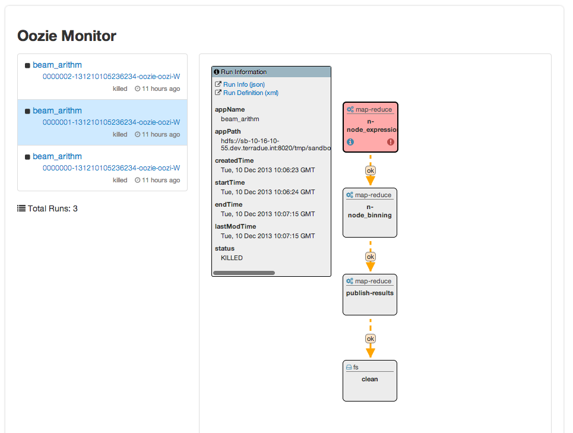
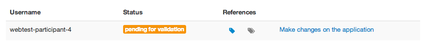
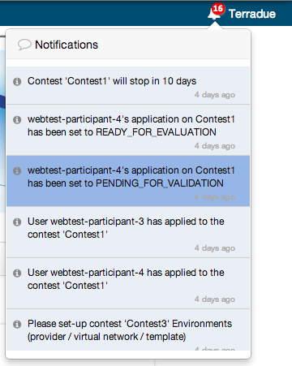
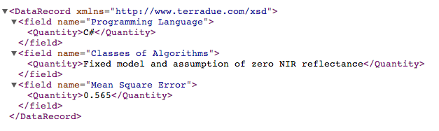

.. E-CEO Data Challenges platform documentation master file, created by
   sphinx-quickstart on Wed Mar 26 11:35:03 2014.
   You can adapt this file completely to your liking, but it should at least
   contain the root `toctree` directive.

Overview
========

.. toctree::
   :maxdepth: 2
   

Purpose of the software
-----------------------

The project addresses the technologies and architectures needed to
provide a collaborative research Platform for automating data mining and
information extraction experiments. The Platform serves for the
implementation of open challenges focusing on Information Extraction for
EO applications. The possibility to implement – through the challenges –
different approaches and algorithms in a common Software Environment
(provided by the collaborative Platform) facilitates the comparison and
the evaluation between different methodologies, which is one of the main
requirements requested by scientific experts who develop algorithms in
the EO field. The project objectives are to provide a collaborative
research Platform for:

- Automation of data mining and information extraction experiments
- Generation of reproducible results that can be easily shared
- Addressing specific scientific challenges and tackling new research problems in a “parallel and collaborative way”

The platform allows the set-up three on-line challenges, which can be
appealing way of conducting research in data mining.

The platform is composed of a front-end (GUI) and a back-end (webserver).

Challenges Phases
-----------------
A challenge (which is the core part of the portal) is divided into 6 phases:

- Challenge is under creation |contestcreated.png|
- Challenge is visible |contestpromoted.png|
- Challenge is open to applications |contestopen.png|
- Challenge is In Progress |contestinprogress.png|
- Challenge is On Evaluation |contestonevaluation.png|
- Challenge is Closed |contestclosed.png|

Phase 1 (Challenge created)
^^^^^^^^^^^^^^^^^^^^^^^^^^^

-  Challenge creation and definition
-  Challenge modification
-  Challenge promotion
-  Challenge users management
-  Series and data package management
-  Data package for challenge management
-  Challenge Environment management
-  Evaluation Criterion creation
-  Evaluation Tree management
-  Notifications cleaning

Phase 2 (Challenge visible)
^^^^^^^^^^^^^^^^^^^^^^^^^^^

-  Challenge description can be accessed

Phase 3 (Challenge promoted)
^^^^^^^^^^^^^^^^^^^^^^^^^^^^

-  Application to a challenge
-  User certificate upload
-  Challenge start
-  Challenge users management
-  Environment creation
-  Notifications cleaning

Phase 4 (Challenge started)
^^^^^^^^^^^^^^^^^^^^^^^^^^^

-  Participant Application status update (packaging)
-  Participant Application status update (validation)
-  Participant Application references update
-  Challenge stop
-  Notifications cleaning

Phase 5 (Challenge ended / on evaluation)
^^^^^^^^^^^^^^^^^^^^^^^^^^^^^^^^^^^^^^^^^

-  Participant Application status update (evaluation)
-  Participant Application references update
-  Environment nodes scalability
-  Notifications cleaning

Phase 6 (Challenge closed)
^^^^^^^^^^^^^^^^^^^^^^^^^^

-  Challenge results are published and accessible.

Challenges User Roles
---------------------

The software can be use by 4 type of users: Participants, Initiators,
Evaluators, Administrators.

Challenge **participants** will use the platform to:

-  get information about a challenge,
-  get information about their Private Environment,
-  get support from the support team,
-  provide information about their application,
-  get application evaluation result

Challenge **initiators** will use the platform to:

-  define a challenge,
-  get challenge status and evolution,
-  accept or reject users for a challenge,
-  define data packages

Challenge **evaluators** will use the platform to:

-  define challenge evaluation tree,
-  evaluate participant application,
-  get information about the Evaluation Environment

Challenge **administrators** will use the platform to:

-  accept or reject users for a challenge,
-  set-up environments,
-  validate participant applications,
-  define data packages

.. |contestpromoted.png| image:: includes/sum/contest_promoted.png
.. |contestopen.png| image:: includes/sum/contest_open.png
.. |contestinprogress.png| image:: includes/sum/contest_in_progress.png
.. |contestonevaluation.png| image:: includes/sum/contest_on_evaluation.png
.. |contestclosed.png| image:: includes/sum/contest_closed.png
.. |settings.png| image:: includes/sum/settings.png
.. |homepage.png| image:: includes/sum/homepage.png
.. |userinfo.png| image:: includes/sum/user_info.png
.. |userprofile.png| image:: includes/sum/user_profile.png
.. |certifupload.png| image:: includes/sum/certif_upload.png
.. |createcontest.png| image:: includes/sum/create_contest.png
.. |modify-icon.png| image:: includes/sum/modify-icon.png
.. |delete.png| image:: includes/sum/delete.png
.. |users.png| image:: includes/sum/users.png
.. |metrics.png| image:: includes/sum/metrics.png
.. |contestmodify.png| image:: includes/sum/contest_modify.png
.. |contestjoin.png| image:: includes/sum/contest_join.png
.. |contestviewmenu.png| image:: includes/sum/contestview_menu.png

.. |contestviewmenudatapackage.png| image:: includes/sum/contestview_menu_datapackage.png
.. |contestviewmenuusers.png| image:: includes/sum/contestview_menu_users.png
.. |contestviewmenuenvironments.png| image:: includes/sum/contestview_menu_environments.png
.. |contestviewmenucriteria.png| image:: includes/sum/contestview_menu_criteria.png
.. |contestviewmenuapplications.png| image:: includes/sum/contestview_menu_applications.png

.. |contestviewmenuevaluationresults.png| image:: includes/sum/contestview_menu_evaluationresults.png
.. |contestviewmenuranking.png| image:: includes/sum/contestview_menu_ranking.png
.. |contestviewdescription.png| image:: includes/sum/contestview_description.png
.. |contestviewdatapackageparticipant.png| image:: includes/sum/contestview_datapackage_participant.png
.. |deleteenv.png| image:: includes/sum/delete_env.png
.. |contestviewdatapackageinitiator.png| image:: includes/sum/contestview_datapackage_initiator.png
.. |contestviewusers.png| image:: includes/sum/contestview_users.png
.. |contestviewenvironments.png| image:: includes/sum/contestview_environments.png
.. |dashboard.png| image:: includes/sum/dashboard.png
.. |oozie.png| image:: includes/sum/oozie.png
.. |dashboardpage.png| image:: includes/sum/dashboard_page.png

.. |contestviewapplicationsparticipant.png| image:: includes/sum/contestview_applications_participant.png
.. |appref.png| image:: includes/sum/appref.png
.. |updateappref.png| image:: includes/sum/update_appref.png

.. |contestviewapplicationsadmin.png| image:: includes/sum/contestview_applications_admin.png
.. |appevalref.png| image:: includes/sum/appevalref.png
.. |updateevalref.png| image:: includes/sum/update_evalref.png
.. |contestviewapplicationsevaluator.png| image:: includes/sum/contestview_applications_evaluator.png
.. |contestviewevaluationtreeevaluator.png| image:: includes/sum/contestview_evaluationtree_evaluator.png
.. |contestviewevaluationtreeparticipant.png| image:: includes/sum/contestview_evaluationtree_participant.png
.. |contestviewmetrics.png| image:: includes/sum/contestview_metrics.png
.. |contestviewscores.png| image:: includes/sum/contestview_scores.png
.. |contestviewlinguisticterms.png| image:: includes/sum/contestview_linguisticterms.png
.. |contestviewevaluationresults.png| image:: includes/sum/contestview_evaluationresults.png
.. |contestviewranking.png| image:: includes/sum/contestview_ranking.png
.. |search.png| image:: includes/sum/search.png
.. |bbox2.png| image:: includes/sum/bbox2.png
.. |bbox1.png| image:: includes/sum/bbox1.png
.. |datapackageitemmanagement.png| image:: includes/sum/datapackage_item_management.png
.. |csvdownload.png| image:: includes/sum/csv_download.png
.. |evaluation.png| image:: includes/sum/evaluation.png
.. |controlpanel.png| image:: includes/sum/controlpanel.png
.. |usermanagement.png| image:: includes/sum/user_management.png
.. |accept.png| image:: includes/sum/accept.png
.. |denied.png| image:: includes/sum/denied.png
.. |participantmanagement.png| image:: includes/sum/participant_management.png
.. |usermanagement3.png| image:: includes/sum/user_management3.png
.. |seriescreation.png| image:: includes/sum/series_creation.png
.. |manageenvironment.png| image:: includes/sum/manage_environment.png

.. |startenv.png| image:: includes/sum/start_env.png
.. |newcriterion.png| image:: includes/sum/new_criterion.png
.. |deletecriterion.png| image:: includes/sum/delete_criterion.png
.. |newcriterionDescription.png| image:: includes/sum/new_criterion_Description.png
.. |criterionpage.png| image:: includes/sum/criterion_page.png
.. |htmlsupport.png| image:: includes/sum/html_support.png
.. |htmlsupport2.png| image:: includes/sum/html_support2.png
.. |bell.png| image:: includes/sum/bell.png

.. |rssfeed.png| image:: includes/sum/rssfeed.png
.. |notificationsfeed.png| image:: includes/sum/notifications_feed.png

.. |scoresxml.png| image:: includes/sum/scoresxml.png
.. |scorescsv.png| image:: includes/sum/scorescsv.png
.. |scorecsvtext.png| image:: includes/sum/scorecsvtext.png