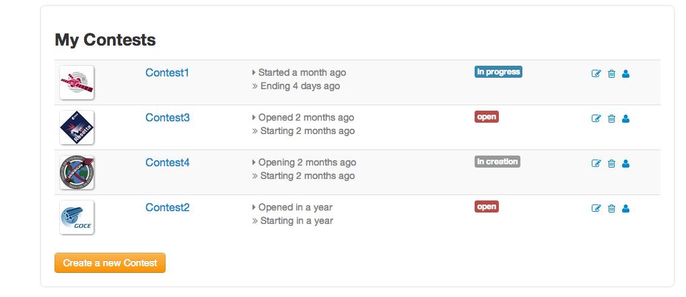
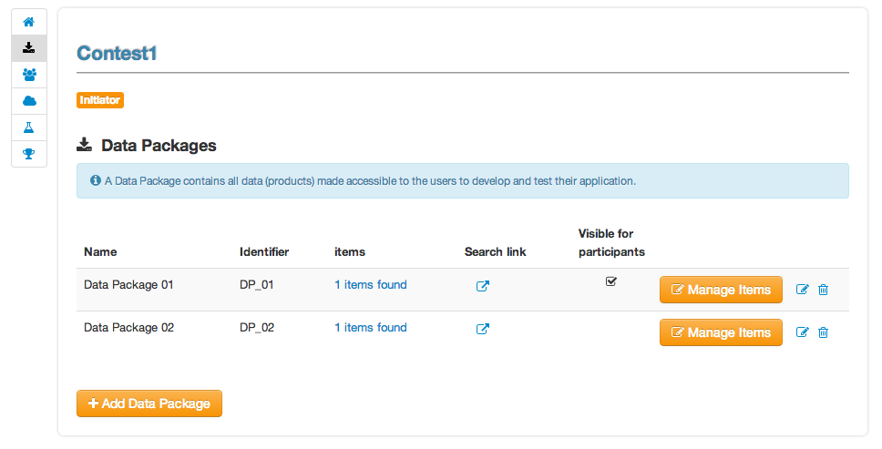
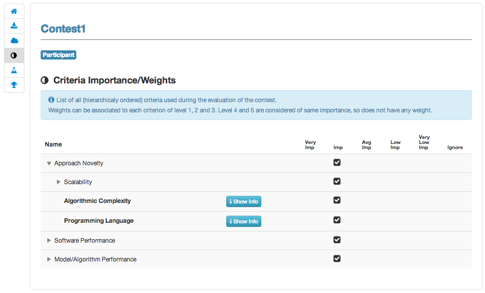
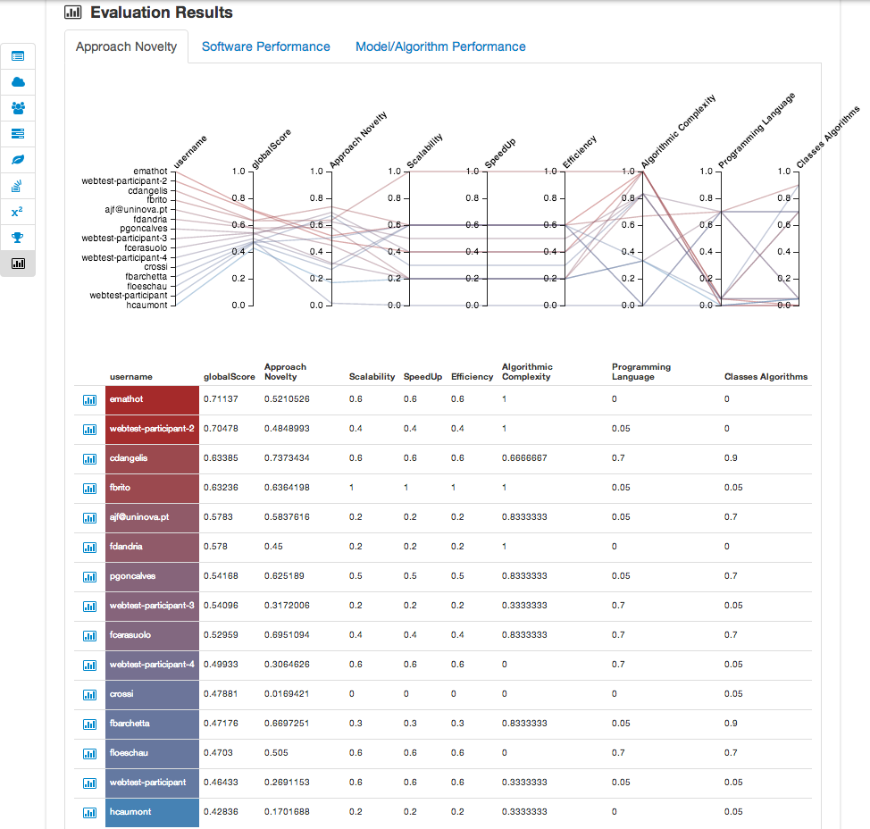
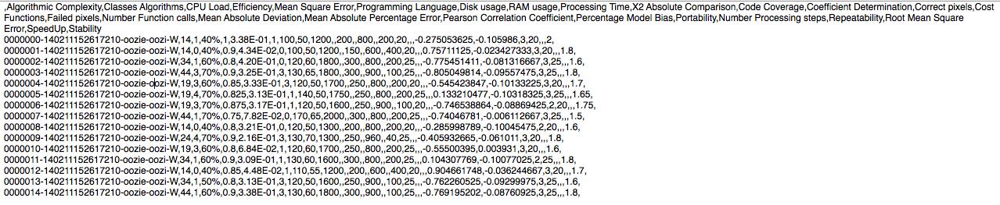

User Guide
==========

This part describes pages of the portal that are common to all users.

Home page
---------

The home page of the E-CEO portal is as shown in the following figure.
It contains a top bar, which is an quick access to all type of challenge
of the portal:

-  My Challenges: the challenges I am involved in.
-  Join a Challenge: open or on-going challenges that a user can join.
-  Upcoming Challenges: future challenges that a user cannot yet join.
-  Past Challenges: closed challenges, only results are accessible.
-  Settings: functionalities only accessible for the administrator
-  User info: access to user information such as account, profile,
   support or help page.
-  Notifications: notifications of the logged user.

The menu bar is updated according to the user logged in (administrator
will have the Settings |homepage.png| button available).

Menu bar
--------

The top menu bar is composed of the following links:

Join a challenge
^^^^^^^^^^^^^^^^
Gives access to description of challenges that are open for participants and thus can be joined (it can be already started challenges).

Upcoming challenges
^^^^^^^^^^^^^^^^^^^
Gives access to description of futures challenges that are not yet open for participants and thus cannot be joined.

Past challenges
^^^^^^^^^^^^^^^
Gives access to description and results of past challenges run on the platform.

Notifications
^^^^^^^^^^^^^
Notifications can be accessed by clicking |bell.png|
in the top of any page. The following list will appear, with all
notifications associated to the current user, along with the number of
days ago it was created. Notifications are ordered by date, from the
newest to the oldest.

|notifications.png|

Clicking on a notification will redirect the browser to the page
corresponding to the notification. The clicked notification will be
removed from the list and considered as “read”.

Notifications can also be accessed by clicking to the link |rssfeed.png|
. The linked page contains a rss feed with all notifications (and could
be used by any feed reader.

|notificationsfeed.png|

Support
^^^^^^^
The support page is accessible from the menu bar, by clicking on
“\ **Support**\ ”. It gives the possibility to a user to have access to
the list of existing support tickets or to create a new one (by clicking
on “\ **New issue**\ ”). Clicking on the Title of the ticket will
redirect to the redmine support page.

|htmlsupport.png|

During the creation of a new ticket, from the interface you can set the
Subject, the Priority as well as the Description. The Assignee will be
by default the E-CEO support team. The ticket can be updated with more
details directly on the redmine support page.

|htmlsupport2.png|

User information
^^^^^^^^^^^^^^^^

From any page, the user can access some infos related to him by clicking
on its name on the top bar.

|userinfo.png|

User profile
~~~~~~~~~~~~

From any page, the user can access its profile by clicking “\ **my profile**\ ” from the top bar (user infos).

Here he can update its information such as email, affiliation, country,
redmine API Key (used to access support tickets) or to receive
notifications via emails.

To update the Redmin API key, the user must click on “\ **Modify Account**\ ” and then set the new API key (can be found on the redmine
profile of the user).

|userprofile.png|

User certificate
~~~~~~~~~~~~~~~~

From any page, the user can access its profile by clicking “\ **my certificate”** from the top bar (user infos).

Here he can ask for a new certificate or upload the one he has. The
certificate is the one used to access the Private Environment.

|certifupload.png|

To update the certificate, the user can browse it by clicking
“\ **Select file**\ ” or just drag the .pem file into the upload box.

Error messages
--------------

When an error occurs, a pop-up message will appear explaining what is
the error to the user.

.. |contestcreated.png| image:: includes/sum/contest_created.png
.. |contestpromoted.png| image:: includes/sum/contest_promoted.png
.. |contestopen.png| image:: includes/sum/contest_open.png
.. |contestinprogress.png| image:: includes/sum/contest_in_progress.png
.. |contestonevaluation.png| image:: includes/sum/contest_on_evaluation.png
.. |contestclosed.png| image:: includes/sum/contest_closed.png
.. |settings.png| image:: includes/sum/settings.png
.. |homepage.png| image:: includes/sum/homepage.png
.. |userinfo.png| image:: includes/sum/user_info.png
.. |userprofile.png| image:: includes/sum/user_profile.png
.. |certifupload.png| image:: includes/sum/certif_upload.png

.. |modify-icon.png| image:: includes/sum/modify-icon.png
.. |delete.png| image:: includes/sum/delete.png
.. |users.png| image:: includes/sum/users.png
.. |metrics.png| image:: includes/sum/metrics.png
.. |contestmodify.png| image:: includes/sum/contest_modify.png
.. |contestjoin.png| image:: includes/sum/contest_join.png
.. |contestviewmenu.png| image:: includes/sum/contestview_menu.png
.. |contestviewmenuhome.png| image:: includes/sum/contestview_menu_home.png
.. |contestviewmenudatapackage.png| image:: includes/sum/contestview_menu_datapackage.png
.. |contestviewmenuusers.png| image:: includes/sum/contestview_menu_users.png
.. |contestviewmenuenvironments.png| image:: includes/sum/contestview_menu_environments.png
.. |contestviewmenucriteria.png| image:: includes/sum/contestview_menu_criteria.png
.. |contestviewmenuapplications.png| image:: includes/sum/contestview_menu_applications.png
.. |contestviewmenumetrics.png| image:: includes/sum/contestview_menu_metrics.png
.. |contestviewmenuevaluationresults.png| image:: includes/sum/contestview_menu_evaluationresults.png
.. |contestviewmenuranking.png| image:: includes/sum/contestview_menu_ranking.png
.. |contestviewdescription.png| image:: includes/sum/contestview_description.png
.. |contestviewdatapackageparticipant.png| image:: includes/sum/contestview_datapackage_participant.png
.. |deleteenv.png| image:: includes/sum/delete_env.png

.. |contestviewusers.png| image:: includes/sum/contestview_users.png
.. |contestviewenvironments.png| image:: includes/sum/contestview_environments.png
.. |dashboard.png| image:: includes/sum/dashboard.png
.. |oozie.png| image:: includes/sum/oozie.png
.. |dashboardpage.png| image:: includes/sum/dashboard_page.png
.. |oozieMonitor.png| image:: includes/sum/oozieMonitor.png
.. |contestviewapplicationsparticipant.png| image:: includes/sum/contestview_applications_participant.png
.. |appref.png| image:: includes/sum/appref.png
.. |updateappref.png| image:: includes/sum/update_appref.png
.. |contestviewapplicationsparticipant2.png| image:: includes/sum/contestview_applications_participant2.png
.. |contestviewapplicationsadmin.png| image:: includes/sum/contestview_applications_admin.png
.. |appevalref.png| image:: includes/sum/appevalref.png
.. |updateevalref.png| image:: includes/sum/update_evalref.png
.. |contestviewapplicationsevaluator.png| image:: includes/sum/contestview_applications_evaluator.png
.. |contestviewevaluationtreeevaluator.png| image:: includes/sum/contestview_evaluationtree_evaluator.png

.. |contestviewmetrics.png| image:: includes/sum/contestview_metrics.png
.. |contestviewscores.png| image:: includes/sum/contestview_scores.png
.. |contestviewlinguisticterms.png| image:: includes/sum/contestview_linguisticterms.png

.. |contestviewranking.png| image:: includes/sum/contestview_ranking.png
.. |search.png| image:: includes/sum/search.png
.. |bbox2.png| image:: includes/sum/bbox2.png
.. |bbox1.png| image:: includes/sum/bbox1.png
.. |datapackageitemmanagement.png| image:: includes/sum/datapackage_item_management.png
.. |csvdownload.png| image:: includes/sum/csv_download.png
.. |evaluation.png| image:: includes/sum/evaluation.png
.. |controlpanel.png| image:: includes/sum/controlpanel.png
.. |usermanagement.png| image:: includes/sum/user_management.png
.. |accept.png| image:: includes/sum/accept.png
.. |denied.png| image:: includes/sum/denied.png
.. |participantmanagement.png| image:: includes/sum/participant_management.png
.. |usermanagement3.png| image:: includes/sum/user_management3.png
.. |seriescreation.png| image:: includes/sum/series_creation.png
.. |manageenvironment.png| image:: includes/sum/manage_environment.png
.. |stopenv.png| image:: includes/sum/stop_env.png
.. |startenv.png| image:: includes/sum/start_env.png
.. |newcriterion.png| image:: includes/sum/new_criterion.png
.. |deletecriterion.png| image:: includes/sum/delete_criterion.png
.. |newcriterionDescription.png| image:: includes/sum/new_criterion_Description.png
.. |criterionpage.png| image:: includes/sum/criterion_page.png
.. |htmlsupport.png| image:: includes/sum/html_support.png
.. |htmlsupport2.png| image:: includes/sum/html_support2.png
.. |bell.png| image:: includes/sum/bell.png
.. |notifications.png| image:: includes/sum/notifications.png
.. |rssfeed.png| image:: includes/sum/rssfeed.png
.. |notificationsfeed.png| image:: includes/sum/notifications_feed.png
.. |metricsxml.png| image:: includes/sum/metricsxml.png
.. |scoresxml.png| image:: includes/sum/scoresxml.png
.. |scorescsv.png| image:: includes/sum/scorescsv.png

